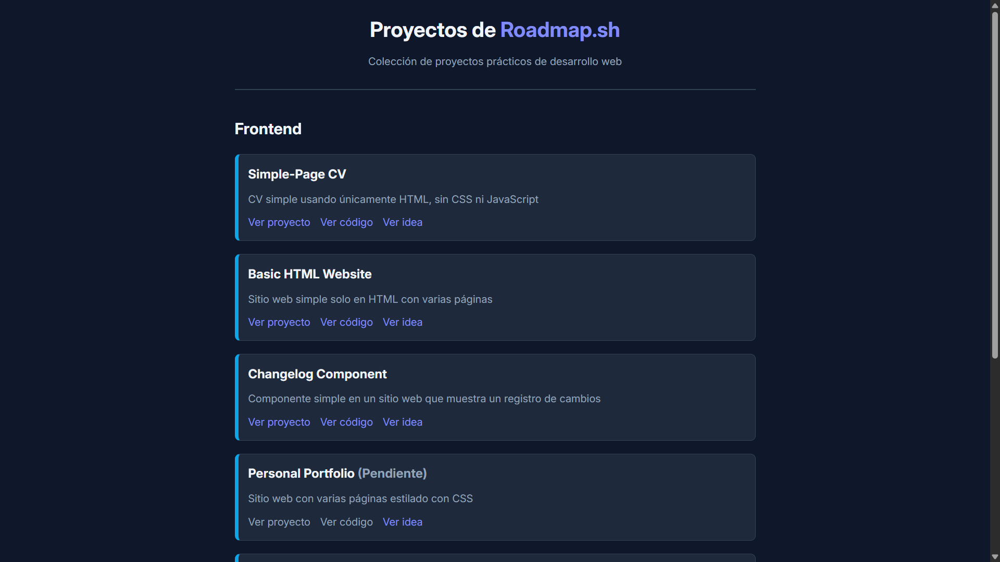

# Roadmap.sh Projects

Todos los proyectos de práctica de las rutas de [roadmap.sh][1].

El objetivo era practicar y ampliar mis conocimientos en desarrollo web. Desplegué todas las soluciones a los proyectos prácticos de [roadmap.sh][1] en un solo repositorio para que estén disponibles al alcance de todos.

---

## 🔗 Ver proyectos
Accede al siguiente enlace para ver los proyectos desplegados:

🚀 [Ver Índice de proyectos][2]

## 👨🏽‍💻 Mis Proyectos
Todos los proyectos realizados, pendientes y en desarrollo:

### Frontend
1. [x] [Single-Page CV](https://roadmap.sh/projects/single-page-cv)
2. [x] [Basic HTML Website](https://roadmap.sh/projects/basic-html-website)
3. [x] [Changelog Component](https://roadmap.sh/projects/changelog-component)
4. [ ] [Personal Portfolio](https://roadmap.sh/projects/portfolio-website)
5. [ ] [Testimonial Cards](https://roadmap.sh/projects/testimonial-cards)
6. [ ] [Datepicker UI](https://roadmap.sh/projects/datepicker-ui)
7. [ ] [Accessible Form UI](https://roadmap.sh/projects/accessible-form-ui)
8. [ ] [Image Grid Layout](https://roadmap.sh/projects/image-grid)
9. [ ] [Tooltip UI](https://roadmap.sh/projects/tooltip-ui)
10. [ ] [Tabs](https://roadmap.sh/projects/simple-tabs)

### Backend
1. [ ] [Task Tracker](https://roadmap.sh/projects/task-tracker)
2. [ ] [GitHub User Activity](https://roadmap.sh/projects/github-user-activity)

## ⭐ Apoyar mi trabajo
Si consideras que estoy haciendo un buen trabajo, puedes votarlo en [roadmap.sh][1] con 👍:

⭐ [Apoyar mi trabajo][3]

## 🖇️ Referencias
Algunos enlaces de interés:

📋 [Ver ideas de proyectos][4]

## ⚠️ Aclaraciones
Aclaraciones respecto a la información proporcionada:

> [!IMPORTANT]
> **Gustavo Persson** es un perfil de desarrollador ficticio creado únicamente para estos proyectos. 
> - No representa a un desarrollador profesional real.
> - La información personal en los proyectos **no es real**.

[1]: https://roadmap.sh
[2]: https://chriscraftx.github.io/Roadmap.sh-Projects/
[3]: https://roadmap.sh/projects/basic-html-website/solutions?u=68bd2cf6d26114391c4bf90c
[4]: https://roadmap.sh/projects