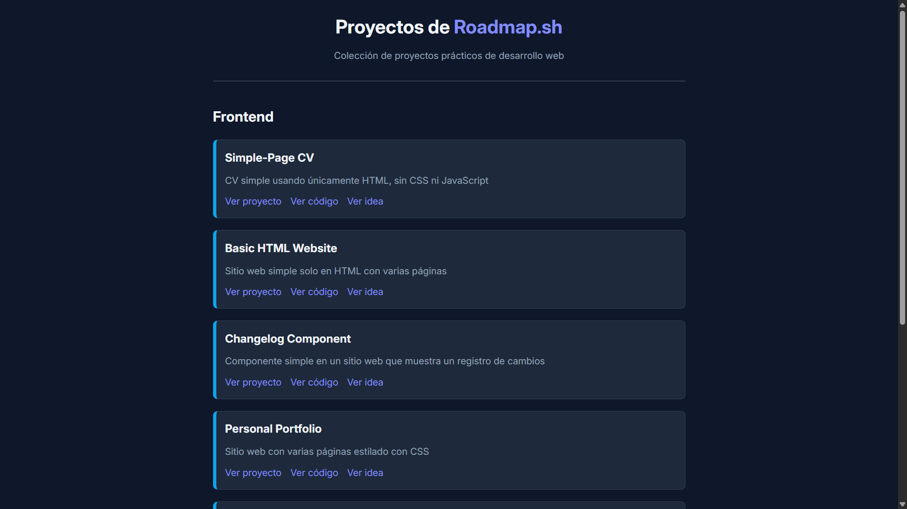

# Roadmap.sh Projects

Todos los proyectos de práctica de las rutas de [roadmap.sh][1].

El objetivo es practicar y ampliar mis conocimientos en desarrollo web. Desplegué todas las soluciones a los proyectos prácticos de [roadmap.sh][1] en un solo repositorio para que estén disponibles al alcance de todos.



---

## 🔗 Ver proyectos

Accede al siguiente enlace para ver los proyectos desplegados:

🚀 [Ver Índice de proyectos][2]

## 👨🏽‍💻 Mis Proyectos

Todos los proyectos realizados, pendientes y en desarrollo:

### Frontend

#### Nivel 1: HTML

1. [x] [Single-Page CV](https://roadmap.sh/projects/single-page-cv)
2. [x] [Basic HTML Website](https://roadmap.sh/projects/basic-html-website)

<details>
  <summary>Proyectos pendientes</summary>

1. [ ] [Pricing Comparison Table](https://roadmap.sh/projects/pricing-comparison-table)
2. [ ] [Blog Post Page](https://roadmap.sh/projects/blog-post-page)
3. [ ] [Contact form](https://roadmap.sh/projects/contact-form)
4. [ ] [Photo Showcase](https://roadmap.sh/projects/photo-showcase)

</details>

#### Nivel 2: CSS

1. [x] [Personal Portfolio](https://roadmap.sh/projects/portfolio-website)
2. [x] [Changelog Component](https://roadmap.sh/projects/changelog-component)
3. [x] [Testimonial Cards](https://roadmap.sh/projects/testimonial-cards)

<details>
  <summary>Proyectos pendientes</summary>

1. [ ] [Datepicker UI](https://roadmap.sh/projects/datepicker-ui)
2. [ ] [Accessible Form UI](https://roadmap.sh/projects/accessible-form-ui)
3. [ ] [Image Grid Layout](https://roadmap.sh/projects/image-grid)
4. [ ] [Tooltip UI](https://roadmap.sh/projects/tooltip-ui)
5. [ ] [Pricing Cards](https://roadmap.sh/projects/pricing-cards)
6. [ ] [Theme Switcher with CSS Variablesbs](https://roadmap.sh/projects/theme-switcher)

</details>

#### Nivel 3: JavaScript

<details>
  <summary>Proyectos pendientes</summary>

1. [ ] [Greeting Builder](https://roadmap.sh/projects/js-greeting-builder)
2. [ ] [Temperature Converter](https://roadmap.sh/projects/js-temperature-converter)
3. [ ] [Number Checker](https://roadmap.sh/projects/js-number-checker)
4. [ ] [String Formatter](https://roadmap.sh/projects/js-string-formatter)
5. [ ] [Price Calculator](https://roadmap.sh/projects/js-price-calculator)
6. [ ] [Cart Total Calculator](https://roadmap.sh/projects/js-cart-total-calculator)
7. [ ] [Grade Report Generator](https://roadmap.sh/projects/js-grade-report-generator)
8. [ ] [Task List Utilities](https://roadmap.sh/projects/js-task-list-utilities)
9. [ ] [Expense Summary](https://roadmap.sh/projects/js-expense-summary)
10. [ ] [Product Search and Filter](https://roadmap.sh/projects/js-product-search-and-filter)
11. [ ] [User Profile Formatter](https://roadmap.sh/projects/js-user-profile-formatter)
12. [ ] [Quiz Score Calculator](https://roadmap.sh/projects/js-quiz-score-calculator)
13. [ ] [JSON Response Normalizer](https://roadmap.sh/projects/js-json-response-normalizer)
14. [ ] [Password Rule Checker](https://roadmap.sh/projects/js-password-rule-checker)
15. [ ] [Order Status Helper](https://roadmap.sh/projects/js-order-status-helper)
16. [ ] [Tabs](https://roadmap.sh/projects/simple-tabs)
17. [ ] [Cookie Consent](https://roadmap.sh/projects/cookie-consent)
18. [ ] [Restricted Textarea](https://roadmap.sh/projects/restricted-textarea)
19. [ ] [Accordion](https://roadmap.sh/projects/accordion)
20. [ ] [Age Calculator](https://roadmap.sh/projects/age-calculator)
21. [ ] [Quiz App](https://roadmap.sh/projects/quiz-app)
22. [ ] [Weather Web App](https://roadmap.sh/projects/weather-app)
23. [ ] [GitHub Random Repository](https://roadmap.sh/projects/github-random-repo)
24. [ ] [Custom Dropdown](https://roadmap.sh/projects/custom-dropdown)
25. [ ] [Task Tracker](https://roadmap.sh/projects/task-tracker-js)
26. [ ] [Reddit Client](https://roadmap.sh/projects/reddit-client)
27. [ ] [Temperature Converter](https://roadmap.sh/projects/temperature-converter)
28. [ ] [24hr Story Feature](https://roadmap.sh/projects/stories-feature)

</details>

### Backend

<details>
  <summary>Proyectos pendientes</summary>

1. [ ] [Task Tracker](https://roadmap.sh/projects/task-tracker)
2. [ ] [GitHub User Activity](https://roadmap.sh/projects/github-user-activity)
3. [ ] [Expense Tracker](https://roadmap.sh/projects/expense-tracker)
4. [ ] [Number Guessing Game](https://roadmap.sh/projects/number-guessing-game)
5. [ ] [Unit Converter](https://roadmap.sh/projects/unit-converter)
6. [ ] [Personal Blog](https://roadmap.sh/projects/personal-blog)

</details>

## ⭐ Apoyar mi trabajo

Si consideras que estoy haciendo un buen trabajo, puedes votarlo en [roadmap.sh][1] con 👍:

⭐ [Apoyar mi trabajo][3]

## 🖇️ Referencias

Algunos enlaces de interés:

📋 [Ver ideas de proyectos][4]

## ⚠️ Aclaraciones

Aclaraciones respecto a la información proporcionada:

> [!IMPORTANT]
> **Gustavo Persson** es un perfil de desarrollador ficticio creado únicamente para estos proyectos.
>
> - No representa a un desarrollador profesional real.
> - La información personal en los proyectos **no es real**.

## 🛠 Desarrollo local

Si quieres contribuir o trabajar en los proyectos localmente:

```bash
# 1. Clona el repo
git clone git@github.com:ChriscraftX/Roadmap.sh-Projects.git
cd Roadmap.sh-Projects

# 2. Instala dependencias (Prettier, Husky, lint-staged y linters)
npm install
```

Al hacer `git commit`, **Prettier formatea automáticamente** los archivos staged (hook `pre-commit` vía `lint-staged`). No necesitas configurar nada más.

### Scripts disponibles

| Comando                | Qué hace                                                 |
| ---------------------- | -------------------------------------------------------- |
| `npm run format`       | Formatea todo el proyecto con Prettier                   |
| `npm run format:check` | Revisa el formato sin modificar archivos                 |
| `npm run lint`         | Ejecuta los tres linters (HTML + CSS + Markdown)         |
| `npm run lint:html`    | Revisa HTML (htmlhint)                                   |
| `npm run lint:css`     | Revisa CSS (stylelint)                                   |
| `npm run lint:css:fix` | Corrige automáticamente el CSS (stylelint --fix)         |
| `npm run lint:md`      | Revisa Markdown (markdownlint)                           |
| `npm run lint:md:fix`  | Corrige automáticamente el Markdown (markdownlint --fix) |

**Editor recomendado**: VS Code. Al abrir la carpeta te sugerirá instalar las extensiones útiles en el desarrollo (Prettier, EditorConfig, Live Server, Stylelint, HTMLHint y markdownlint).

---

[1]: https://roadmap.sh
[2]: https://chriscraftx.github.io/Roadmap.sh-Projects/
[3]: https://roadmap.sh/projects/basic-html-website/solutions?u=68bd2cf6d26114391c4bf90c
[4]: https://roadmap.sh/projects
