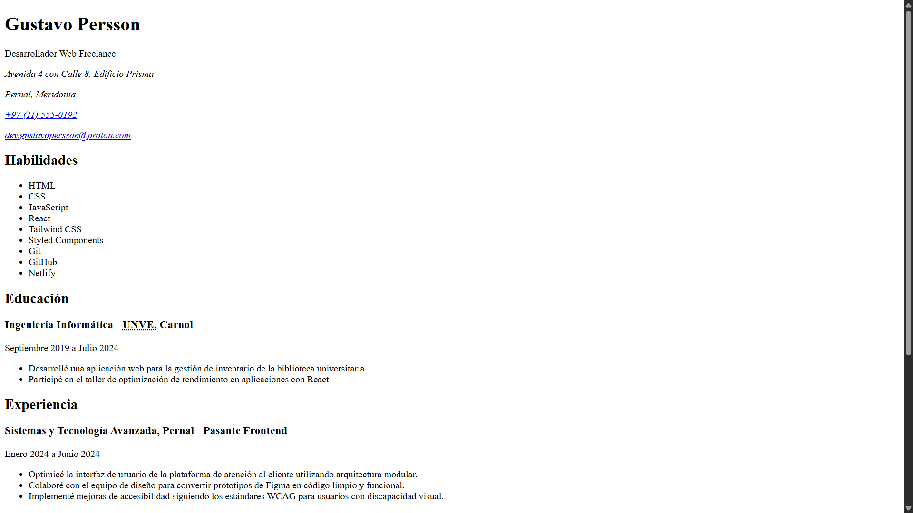

# Simple-Page CV

Primer proyecto de la ruta de Frontend de [roadmap.sh][1].

El objetivo fue crear un CV estructurado usando únicamente HTML, sin CSS ni JavaScript, poniendo foco en semántica correcta, metadatos SEO y etiquetas Open Graph.

---

## 🔗 Ver proyecto
Accede al siguiente enlace para ver el proyecto desplegado:

🚀 [Ver Solución][2]

🏠 [Ver Índice de proyectos][5]

## 🎯 ¿Cuáles son los requisitos del proyecto?
Los requerimientos para cumplir con una solución óptima fueron:

- [x] HTML semántico
- [x] Meta tags esenciales para SEO
- [x] Etiquetas Open Graph para previsualización en redes sociales
- [x] Favicons modernos
- [x] Buenas prácticas

## ⭐ Apoyar mi trabajo
Si consideras que cumplí correctamente cada requisito, puedes votarlo en roadmap.sh con 👍:

⭐ [Apoyar mi trabajo][3]

## 🖇️ Referencias
Algunos enlaces de interés:

📋 [Ver idea del proyecto][4]

## ⚠️ Aclaraciones
Aclaraciones respecto a la información proporcionada:

> [!IMPORTANT]
> **Gustavo Persson** es un perfil de desarrollador ficticio creado únicamente para estos proyectos. 
> - No representa a un desarrollador profesional real.
> - La información personal en los proyectos **no es real**.

[1]: https://roadmap.sh
[2]: https://chriscraftx.github.io/Roadmap.sh-Projects/frontend/01-single-page-cv
[3]: https://roadmap.sh/projects/single-page-cv/solutions?u=68bd2cf6d26114391c4bf90c
[4]: https://roadmap.sh/projects/single-page-cv
[5]: https://chriscraftx.github.io/Roadmap.sh-Projects/