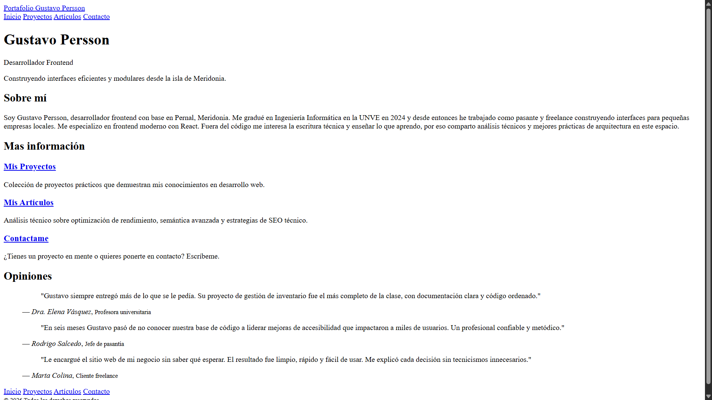

# Basic HTML Website

Segundo proyecto de la ruta de Frontend de [roadmap.sh][1].

El objetivo fue crear un sitio web simple solo en HTML con página `Principal`, `Proyectos`, `Artículos` y `Contacto`. Además me tomé el atrevimiento de usar la metodología de `Directory-based Routing` (_Enrutamiento basado en directorios_) y la técnica de `Pretty URLs` (_URLs limpias_) para los enlaces de las páginas aunque para el proyecto era innecesario.

---

## 🔗 Ver proyecto

Accede al siguiente enlace para ver el proyecto desplegado:

🚀 [Ver Solución][2]

🏠 [Ver Índice de proyectos][5]

## 🎯 ¿Cuáles son los requisitos del proyecto?

Los requerimientos para cumplir con una solución óptima fueron:

- [x] Sitio web con páginas:
  - Homepage
  - Projects
  - Articles
  - Contact
- [x] Estructura semántica utilizando HTML
- [x] Meta tags esenciales para SEO en cada página
- [x] Barra de navegación en todas las páginas y que las conecte a todas
- [x] Página de contacto con formulario para enviar email
- [x] Buenas prácticas

## ⭐ Apoyar mi trabajo

Si consideras que cumplí correctamente cada requisito, puedes votarlo en roadmap.sh con 👍:

⭐ [Apoyar mi trabajo][3]

## 🖇️ Referencias

Algunos enlaces de interés:

📋 [Ver idea del proyecto][4]

## ⚠️ Aclaraciones

Aclaraciones respecto a la información proporcionada:

> [!IMPORTANT]
> **Gustavo Persson** es un perfil de desarrollador ficticio creado únicamente para estos proyectos.
> - No representa a un desarrollador profesional real.
> - La información personal en los proyectos **no es real**.

[1]: https://roadmap.sh
[2]: https://chriscraftx.github.io/Roadmap.sh-Projects/frontend/02-basic-html-website
[3]: https://roadmap.sh/projects/basic-html-website/solutions?u=68bd2cf6d26114391c4bf90c
[4]: https://roadmap.sh/projects/basic-html-website
[5]: https://chriscraftx.github.io/Roadmap.sh-Projects/