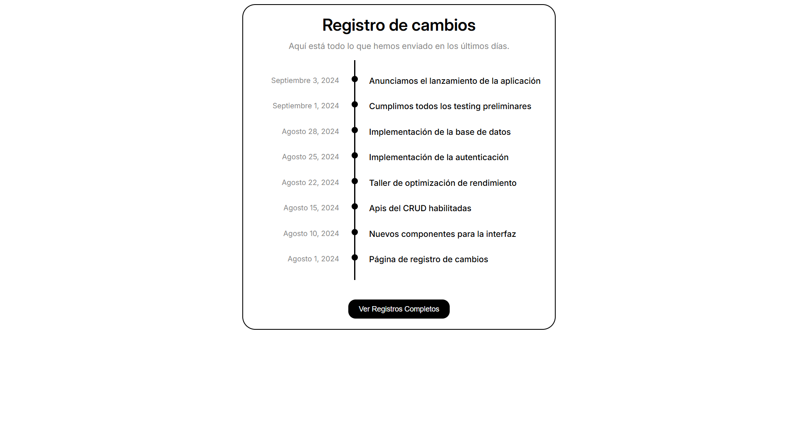

# Changelog Component

Tercer proyecto de la ruta de Frontend de [roadmap.sh][1].

El objetivo fue crear un componente simple para un sitio web que muestre un registro de cambios aplicando posicionamiento y diseño en CSS. Aunque se me permitía libertad creativa preferí enfocarme en la maqueta de ejemplo que se me presentaba, desbordare toda mi creatividad en proyectos posteriores.

---

## 🔗 Ver proyecto

Accede al siguiente enlace para ver el proyecto desplegado:

🚀 [Ver Solución][2]

🏠 [Ver Índice de proyectos][5]

## 🎯 ¿Cuáles son los requisitos del proyecto?

Los requerimientos para cumplir con una solución óptima fueron:

- [x] Estructura semántica utilizando HTML simple
- [x] Posicionamiento y diseño en CSS
- [x] Dibujar la lineá de tiempo en el diseño
- [x] Componente responsivo
- [x] Libertad creativa
- [x] Buenas prácticas

## ⭐ Apoyar mi trabajo

Si consideras que cumplí correctamente cada requisito, puedes votarlo en roadmap.sh con 👍:

⭐ [Apoyar mi trabajo][3]

## 🖇️ Referencias

Algunos enlaces de interés:

📋 [Ver idea del proyecto][4]

## ⚠️ Aclaraciones

Aclaraciones respecto a la información proporcionada:

> [!IMPORTANT]
> **Gustavo Persson** es un perfil de desarrollador ficticio creado únicamente para estos proyectos.
> - No representa a un desarrollador profesional real.
> - La información personal en los proyectos **no es real**.

[1]: https://roadmap.sh
[2]: https://chriscraftx.github.io/Roadmap.sh-Projects/frontend/03-changelog-component
[3]: https://roadmap.sh/projects/changelog-component/solutions?u=68bd2cf6d26114391c4bf90c
[4]: https://roadmap.sh/projects/changelog-component
[5]: https://chriscraftx.github.io/Roadmap.sh-Projects/