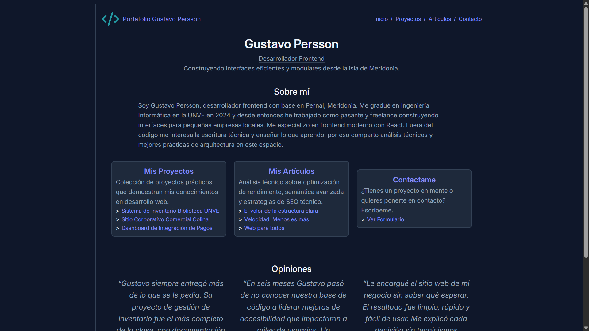

# Personal Portfolio

Cuarto proyecto de la ruta de Frontend de [roadmap.sh][1].

El objetivo fue diseñar el sitio web creado en el proyecto [Basic HTML Website](https://chriscraftx.github.io/Roadmap.sh-Projects/frontend/02-basic-html-website) y aprender a crear diseños responsivos, aplicar color y tipografía.

---

## 🔗 Ver proyecto

Accede al siguiente enlace para ver el proyecto desplegado:

🚀 [Ver Solución][2]

🏠 [Ver Índice de proyectos][5]

## 🎯 ¿Cuáles son los requisitos del proyecto?

Los requerimientos para cumplir con una solución óptima fueron:

- [x] Basar el proyecto en Basic HTML Website
- [x] Uso consistente de una combinación de colores y tipografía elegidas
- [x] Uso adecuado de técnicas CSS como Flexbox, consultas de medios y el modelo de caja
- [x] Una barra de navegación responsiva y un formulario de contacto bien diseñado
- [x] Uso [Fuentes de Google](https://fonts.google.com/) para mejorar la tipografía de su sitio web
- [x] Agregue soporte para el modo oscuro usando variables CSS
- [x] Buenas prácticas

## ⭐ Apoyar mi trabajo

Si consideras que cumplí correctamente cada requisito, puedes votarlo en roadmap.sh con 👍:

⭐ [Apoyar mi trabajo][3]

## 🖇️ Referencias

Algunos enlaces de interés:

📋 [Ver idea del proyecto][4]

## ⚠️ Aclaraciones

Aclaraciones respecto a la información proporcionada:

> [!IMPORTANT]
> **Gustavo Persson** es un perfil de desarrollador ficticio creado únicamente para estos proyectos.
> - No representa a un desarrollador profesional real.
> - La información personal en los proyectos **no es real**.

[1]: https://roadmap.sh
[2]: https://chriscraftx.github.io/Roadmap.sh-Projects/frontend/04-personal-portfolio
[3]: https://roadmap.sh/projects/portfolio-website/solutions?u=68bd2cf6d26114391c4bf90c
[4]: https://roadmap.sh/projects/portfolio-website
[5]: https://chriscraftx.github.io/Roadmap.sh-Projects/